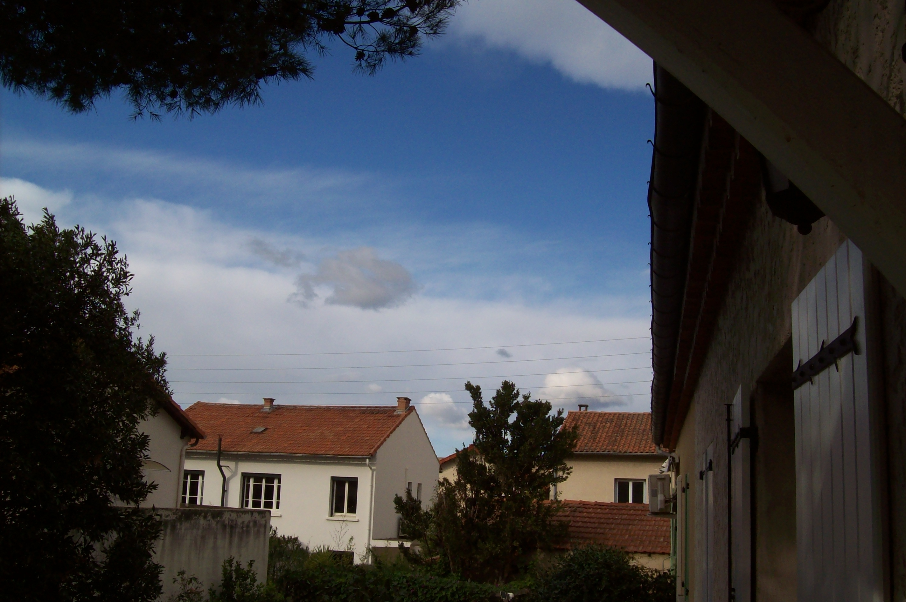

# Case Study: Cold Mistral, Mixed-Phase Stratocumulus and a Mediterranean Cut-Off Low  
*Human + AI Assisted Meteorological Analysis – 21 November 2025*

This repository presents an integrated weather analysis combining:

- **Human field observation** (cloud morphology under cold mistral conditions in southern France),  
- **AI-assisted reasoning** (Lyra, GPT‑5.1),  
- **Multi‑source meteorological data**: METAR, surface pressure charts, TEMSI France, TEMSI EUROC, and radiosonde profiles.

The goal is to illustrate how a single **visual cloud anomaly**—observed from the Rhône Valley—can be expanded into a full synoptic and dynamic interpretation, using a workflow where human expertise and AI structure the reasoning together.

---

## 1. Geographic & Atmospheric Context

- **Location:** Avignon, Rhône Valley, Southeastern France (Mediterranean basin).  
- **Date:** 21 November 2025.  
- **Weather regime:**  
  - Strong *mistral* (continental north–northwest wind channeled between the Alps and Massif Central),  
  - Cold, dry post‑frontal air mass,  
  - Exceptional **low freezing level** (≈ 2500 ft / 750 m),  
  - Clear visibility and high atmospheric transparency.

### Human visual trigger  
A cloud layer showing:

- Stratocumulus **polished and smoothed**,  
- Homogeneous texture,  
- A faint **cirriform appearance** despite being unusually low,  
- Presence of small **orographic lenticular features** (not captured in the photo but confirmed visually).

This visual anomaly initiated a full-scale meteorological investigation.

<p align="center">
  
</p>


---

## 2. Files Provided in This Repository

- `nuages.jpg` — Cloud photograph taken from Avignon  
- `petit_emagramme.jpg` — Radiosonde diagram (Nîmes, France)  
- `pression.jpg` — Surface pressure chart (Europe)  
- `temsi_france.pdf` — TEMSI France (surface to FL100)  
- `temsi_euroc.pdf` — TEMSI EUROC (FL150–450)  

Each document contributes to reconstructing the vertical and horizontal structure of the atmosphere at the time of observation.

---

## 3. Human + AI Methodology

### Human Contribution (Jérôme)

The human analysis included:

- Detection of the **cloud morphology anomaly**.  
- Deduction of **mixed-phase stratocumulus** partially transformed into ice clouds.  
- Recognition of key large‑scale structures:  
  - **Jetstream with a Rossby-wave pattern**,  
  - **Polar front undulation**,  
  - **Positive Vorticity Advection (PVA)** at jet entrance/exit,  
  - **Tropopause folding** and **local lowering** (≈ FL220) characteristic of a **cold cut-off low**,  
  - Links between cut-off low and **ACCAS / embedded cumulonimbus** over a still‑warm Mediterranean Sea.  
- Integrated reading of METAR, pressure fields, TEMSI charts, and radiosonde data.  
- Cross-referencing with previous field experience (mountain meteorology and cold-season cloud behavior).

### AI Contribution (Lyra)

Lyra (GPT‑5.1) assisted by:

- Structuring the reasoning into a **scientific and pedagogical sequence**,  
- Clarifying concepts (Rossby waves, PVA, divergence aloft, cut-off formation),  
- Ensuring terminological accuracy for an international audience,  
- Harmonizing the narrative and improving reproducibility.

The reasoning remains human-led; the AI enhances readability and structure.

---

## 4. Step-by-Step Scientific Interpretation

### 4.1 Microphysics (Mixed-Phase Stratocumulus)

Observed features correspond to:

- Stratocumulus in a **subfreezing environment**,  
- Fraction of liquid droplets **sublimated** by extremely dry mistral airflow,  
- Survival of **ice crystals**, producing a low-level cirrus-like aspect,  
- Strong vertical wind shear → **lamination and smoothing** of cloud tops.

This phenomenon is common in high-altitude regions but rare in the Mediterranean basin.

---

### 4.2 Surface-Level Evidence (METAR & Pressure Field)

**METAR from Avignon (LFMV):**  
`35029G43KT 9999 FEW046 OVC110 06/M03 Q1012`

Key elements:

- North wind 29 kt (gusting 43 kt) → typical mistral acceleration.  
- Temperature 6°C, dew point –3°C → **very dry air mass**.  
- FEW046 → small cloud elements near 4600 ft, consistent with a cold mixed layer.  

**Pressure field:**  
- High pressure over the Northeast Atlantic,  
- Low pressure over the Gulf of Genoa / Corsica,  
- Strong horizontal gradient along the Rhône Valley.

This configuration reinforces mistral flow by a **geographical Venturi effect** (Alps–Massif Central corridor).

#### European Surface Pressure Chart – 21 Nov 2025


---

### 4.3 Synoptic Analysis (TEMSI France)

TEMSI France shows:

- Widespread **stratus / stratocumulus** over the Massif Central,  
- Bases 500–1000 ft, tops 1500–2000 ft,  
- **Freezing level at ground level** across the region,  
- Moderate to strong **orographic turbulence**,  
- Conditions matching pre‑snow patterns in continental climates.

---

### 4.4 Jetstream & Upper-Level Dynamics (TEMSI EUROC)

This is the critical part identified by the human analysis:

- **Jetstream near 100 kt**, showing a **Rossby wave undulation**,  
- Curvature and wind maximum signal *advection of cyclonic vorticity upward*,  
- **Tropopause sharply lowered** near the Gulf of Lion (≈ FL220),  
- Formation of a **cold cut-off low** (high-PV anomaly),  
- Development of **ACCAS (altocumulus castellanus)** and **embedded cumulonimbus** above the warm Mediterranean.

This duality explains the coexistence of:

- Dry polar airmass → cold mistral + ice-bearing stratocumulus,  
- Maritime instability → elevated convection south of the Rhône delta.

---

### 4.5 Radiosonde Validation (Nîmes)

The radiosonde confirms:

- Saturation layer near **800 hPa (~1900 m / 6000 ft)** at **–10°C**,  
- Presence of a **laminating inversion** just above,  
- Tropospheric **north flow**, turning west in lower stratosphere → matches Jet analysis.

This fully validates the initial visual hypothesis.

---

## 5. Scientific Synthesis

This case study illustrates how:

- A single **cloud morphology anomaly** can reveal  
  → air mass type,  
  → dynamic forcing,  
  → jetstream architecture,  
  → cut-off low presence.  

- Human expertise identifies key signatures,  
- AI organizes the reasoning,  
- Together they reconstruct a multi‑scale atmospheric event, from microphysics to planetary‑scale dynamics.

---

## 6. Repository Structure

```
mistral_mediterranee_2025_11_21/
├── README.md
├── README_en.md
├── nuages.jpg
├── petit_emagramme.jpg
├── pression.jpg
├── temsi_france.pdf
└── temsi_euroc.pdf
```

---

## 7. Credits

**Human analysis:** Jérôme  
**AI assistance:** Lyra (GPT‑5.1)

A combined human–AI workflow illustrating modern atmospheric analysis practice.
